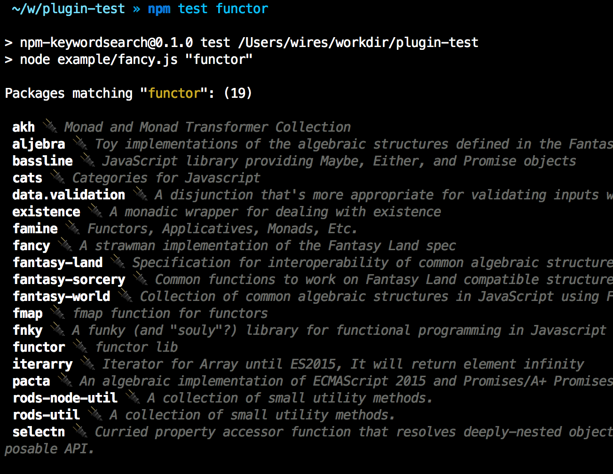

# Fetch list of packages on NPM with specified keyword

This queries the NPM registry with
[`npm-registry-client`](https://github.com/npm/npm-registry-client)
It lists all packages matching a keyword using the CouchDB view `byKeyword`.

#### Install

```sh
npm install --save npm-keywordsearch # yep
```

Test `npm test whatever-keyword`

[](example/fancy.js)


#### API

```js
var search = require('npm-keywordsearch')

search('my-plugin', function (error, packages) {
  packages.forEach(function (pkg) {
    console.log(pkg.name + ': ' + pkg.description)
  })
})
```

Based of http://stackoverflow.com/a/13657540/72787.

#### Related

If you want a build a plugin system out of this,
https://github.com/c9/architect does a good job.
